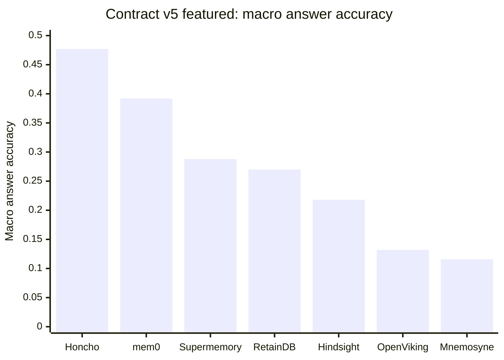

# MemConflict memory-provider benchmark

This project compares self-hostable long-term **memory providers** for the
Hermes agent on the
[MemConflict](https://github.com/TaoZhen1110/MemConflict) benchmark. The
benchmark measures how well each provider retrieves and uses the memory item
that is temporally valid, factually correct, and contextually applicable, in the
case where a user's stored facts conflict across multi-session dialogues.

Every provider runs the same harness contract. The harness uses MemConflict
`Step4_4.jsonl` (30 personas, 3,750 questions). Each provider emits
`Model_Answer` and `Retrieved_Memories` per question. One shared,
provider-agnostic scorer judges the output. The headline metric is macro answer
accuracy, answer accuracy averaged evenly across the benchmark's conflict
categories.

The results are also published as an interactive site at
<https://engturtle.github.io/hermes-memconflict/>. The site has a benchmark
report and a conversation browser for the MemConflict dialogues.

## Documentation

| Document | What it covers |
|---|---|
| [Benchmark report](https://engturtle.github.io/hermes-memconflict/report/) | Interactive version of the benchmark matrix: providers, configurations, and results |
| [Conversation browser](https://engturtle.github.io/hermes-memconflict/memconflict-sessions/) | MemConflict dialogues as chat transcripts, with conflict annotations and questions |
| [docs/BENCHMARK_MATRIX.md](docs/BENCHMARK_MATRIX.md) | Providers, every configuration and feature flag, measured results |
| [docs/DECISIONS.md](docs/DECISIONS.md) | Why the benchmark is built this way, including decisions that were reversed |
| [docs/TROUBLESHOOTING.md](docs/TROUBLESHOOTING.md) | Symptom, cause, fix, and what did not work |
| [benchmark/docker/README.md](benchmark/docker/README.md) | Container stack, per-provider env var reference, run commands |
| [CLAUDE.md](CLAUDE.md) | Operating contract for agents working in this repo |

## What is being compared

This project selects a provider for Hermes to deploy, so each provider runs in
the best-effort configuration a real deployment would use. Vendor-exposed
settings that make a provider's framework work better on the serving model are
part of that configuration. The same standard applies to every provider, and the
project prefers values the vendor or model card already endorses over hand-picked
ones.

The fairness line sits at the **shared harness**. The shared harness fixes the
dataset, answer model, judge model and decoding, top-K, prompts, and scorer. A
change to the shared harness that helps or hurts one provider invalidates the
comparison. Tuning a setting the vendor exposes does not. Tuning a setting until
a number improves is out of bounds. [docs/DECISIONS.md](docs/DECISIONS.md)
records every deviation from a shipped default, with its evidence.

## Layout

| Path | What it is |
|---|---|
| `benchmark/` | Shared harness: scorer, resumable judge, summarizer, LLM glue, container stack, pinned deps |
| `docs/` | Decisions, troubleshooting, benchmark matrix |
| `mnemosyne/` | [Mnemosyne](https://github.com/mnemosyne-oss/mnemosyne) adapter, results, scores |
| `hindsight/` | Hindsight adapter, sharded across containers |
| `mem0/` | [mem0](https://github.com/mem0ai/mem0) adapter |
| `supermemory/` | [Supermemory](https://github.com/supermemoryai/supermemory) self-hosted adapter |
| `honcho/` | [Honcho](https://github.com/plastic-labs/honcho) self-hosted adapter (FastAPI API plus a background extraction worker) |
| `openviking/` | OpenViking self-hosted adapter (memory tree, one server spawned per shard) |
| `retaindb_server/` | RetainDB **server** edition adapter and vendor patch layer |
| `retaindb/` | RetainDB **local** edition adapter, ruled out (kept for the record) |
| `external/` | Pinned submodules: `MemConflict` (dataset and judge), `mnemosyne`, `RetainDB`, `honcho`, `hermes-agent` |

Every provider folder sits exactly one level under the repo root. Each provider
folder holds its own `eval_<provider>.py`, `Results/`, and `Scores/`. Adapters
resolve the dataset path as `../external/MemConflict/...`, so nesting a provider
folder deeper breaks those paths silently. Clone the repository with
`--recurse-submodules`.

## Results

The featured comparison runs on **contract v5**, which serves the `qwen3.5-4b`
answer model with a 131,072-token generation window and the `gte-modernbert-base`
embedder at 768 dimensions. One shared judge, `gemma-4-12b`, scores every answer under a penalty
rubric. A correct answer scores 1.0, a partial 0.5, an absent or uncertain
answer 0.0, and a wrong or contradictory answer **−1**. The −1 case falls outside
the standard MemConflict range, so these numbers compare only to each other.

The **macro answer accuracy** column is the headline score: answer accuracy
averaged evenly across the benchmark's conflict categories, so no category
dominates. A macro gap under about ±0.025 is judge-sampling noise, so providers
inside that band are not ranked against each other. The fuller metric set (micro
accuracy, supporting evidence hit, and the by-category split) is in
[docs/BENCHMARK_MATRIX.md](docs/BENCHMARK_MATRIX.md).

| Provider | Configuration (run tag) | Macro AA |
|---|---|--:|
| Honcho | featured (`v5ftc`) † | **0.477** |
| mem0 | featured (`v5ftc`) | **0.392** |
| Supermemory | featured (`v5ftc`) | **0.288** |
| Hindsight | diagnostic, all recall types (`v5ftcall`) | 0.281 |
| RetainDB server | featured (`v5ftc`) | **0.270** |
| Hindsight | featured, observation-only recall (`v5ftc086`) | **0.218** |
| OpenViking | featured (`v5ftovk`) | **0.132** |
| Mnemosyne | featured (`v5ftc`) | **0.116** |

The run tag in each row is the on-disk identifier of that wave under
`<provider>/Scores/`. Hindsight has two rows: its featured configuration
(`v5ftc086`) recalls only observation memories, the plugin default, while the
`v5ftcall` row is a diagnostic that recalls every memory type. The graph below
plots each provider's featured configuration and omits that diagnostic row.




What the numbers show, stated in full in
[docs/BENCHMARK_MATRIX.md](docs/BENCHMARK_MATRIX.md):

- No provider reaches 0.5 macro answer accuracy. Honcho leads at 0.477 and the
  field falls to Mnemosyne at 0.116, so conflicting-memory retrieval is hard for
  every system tested.
- Supermemory (0.288), the Hindsight all-recall configuration (0.281), and
  RetainDB (0.270) span 0.018 macro, inside the noise band, and reach it by
  different routes. They are not separated.

## Running

The primary path uses Docker, from `benchmark/docker/`:

```bash
docker compose up -d vllm-gen vllm-embed                    # shared inference servers
docker compose run -d --rm mnemosyne                        # a full Mnemosyne run
docker compose run -d --rm -e NUM_PERSONAS=1 -e RUN_TAG=smoke mnemosyne
```

`STAGE` selects `generate|score|summarize|all`. Start long runs detached, then
monitor them. See [benchmark/docker/README.md](benchmark/docker/README.md) for
the full env-var surface and per-provider sharding.

The scorer and summarizer are provider-agnostic and score any provider's output.
